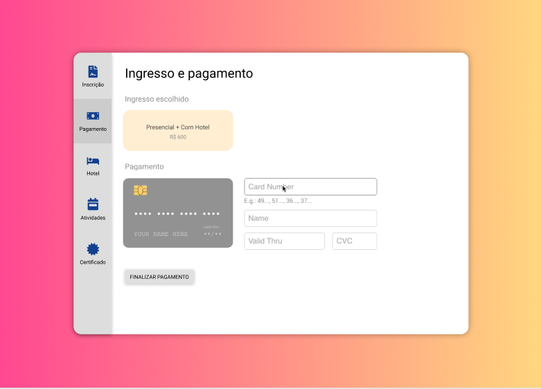
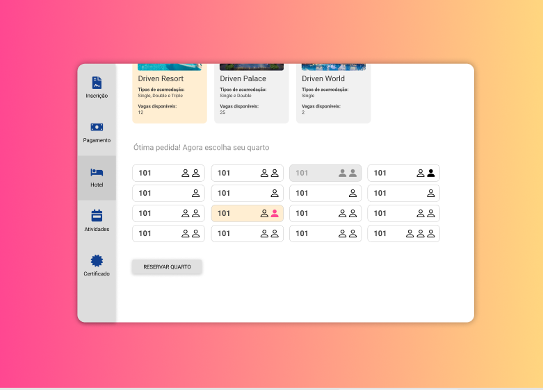
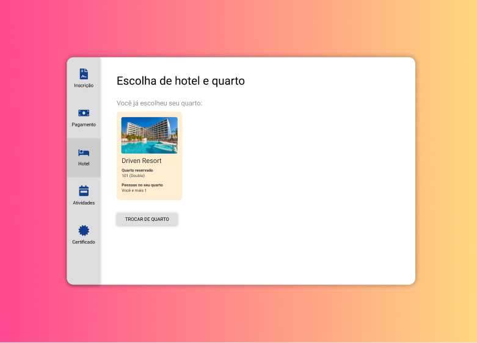
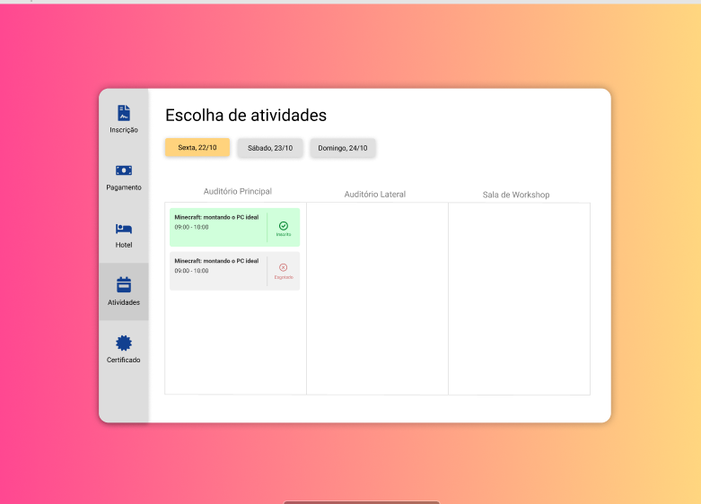

# Drivent

The complete layout of this project can be found in [Figma](https://www.figma.com/file/86TbwAX92S6xNIHrcd7s8S/Drivent?type=design&node-id=0-1&mode=design&t=syr1fKVJ46SwFLTr-0)

## Overview

Full stack project of an event management system, with the application managing a single event for each instance of the system running (White Label), in order to serve the end customer who is the event organizer. The project was carried out in a group of four people, during a bootcamp, over the course of a month and divided into four sprints.

## Project Operation

* There is a timer that only releases the system on the Event registration start date.
* The user must register for the Event (online or in person).
* For an in-person event, the user can choose whether they want it with or without accommodation (hotel).
* The user can also choose a payment method.
* In addition, the user also chooses their activities at the event.
* Finally, it is also possible to issue a certificate of participation in the event.

## Technologies Used

* Typrescript, Node.js, Express.js, React.js
* PostgreSQL and Redis database
* Nginx, Docker
* Tests with Jest and Supertest
* eslint, prisma
* jwt, bcrypt, joi, dotenv, dayjs, axios

